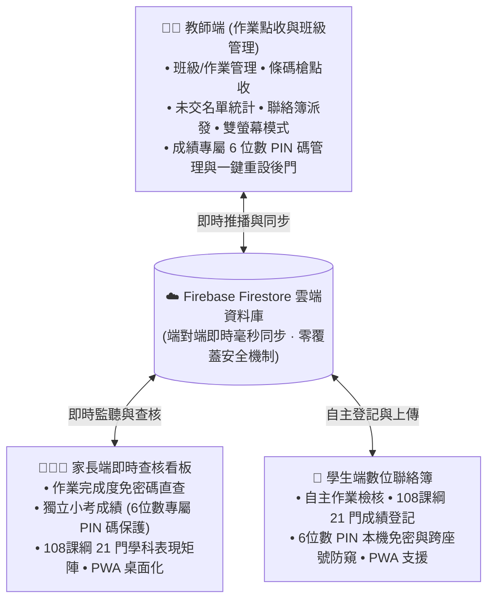

# 班級經營系統 3.0 (Teacher App & Main Portal)

> **一點，收齊作業；一連，串起親師。**  
> 由高雄市立七賢國中 107 王禹硯（國一生）獨立編程設計打造，專為台灣中小學校園現場教學痛點研發的全方位班級作業點收、條碼掃描辨識、多班級管理、親師聯絡簿整合、成績系統 PIN 碼管理與雲端/本地即時同步解決方案。

---

## 📌 系統全景與三大端架構

本系統由**教師端（本專案）**、**家長端**與**學生端**三大獨立又緊密聯動的 Web 應用程式組成，致力於全面數位化取代傳統紙本作業登記簿與聯絡簿：



- 🌐 **教師端與門戶首頁**：[https://ian1021228.github.io/homework_checker3.0/](https://ian1021228.github.io/homework_checker3.0/)
- 👨‍👩‍👧 **家長端即時查核看板**：[https://ian1021228.github.io/ian_homework_checker2.0_online_parent_dashboard/](https://ian1021228.github.io/ian_homework_checker2.0_online_parent_dashboard/)
- 🎒 **學生端數位聯絡簿與成績登記**：[https://ian1021228.github.io/ian_homework_checker2.0_online_student_dashboard/](https://ian1021228.github.io/ian_homework_checker2.0_online_student_dashboard/)

---

## ✨ 教師端核心亮點功能

### 1. 多元點收作業模式
- **座號矩陣點收**：依班級座號一覽點選，顏色即時區分「已交（綠）」、「未交（紅）」、「待訂正（黃）」與「請假」。
- **實體條碼槍掃描**：相容市售標準 USB / 藍牙條碼掃描槍，連續掃描學生聯絡簿條碼即可自動切換為已繳交，大幅縮短早自習點收時間。
- **手機鏡頭掃碼**：支援 HTML5 Web 相機直接辨識 QR Code / 條碼。
- **鍵盤數字極速點收**：支援鍵盤直接輸入座號加 Enter 秒速完成登記。

### 2. 班級與作業智慧管理
- **多班級無縫切換**：國高中科任老師可輕鬆管理 10+ 個不同任教班級，班級名稱支援即時編輯與改名。
- **專屬班級代碼與直達連結**：一鍵複製帶有 `?code=[班級代碼]` 的專屬分享連結，家長與學生點擊即可直達所屬班級，免除手動輸入繁瑣步驟。
- **未交名單智慧統計**：即時計算各項作業缺交座號，提供一鍵複製「未交名單純文字」以便直接貼至班級 LINE 群組通報。

### 3. 🔑 成績系統專屬 PIN 碼後台管理與一鍵重設後門
- **導師把關開通機制**：學生與家長必須等到導師在後台設定開通 PIN 碼後方可使用成績系統，防範未經授權之存取。
- **批次開通與預設生成**：提供「全部開通預設（`100000 + 座號`）」、「隨機生成 6 位密碼」與「全部清除」等批次工具。
- **座號獨立控管與一鍵重設**：若學生忘記密碼，導師可在後台點擊「一鍵重設」，即刻重置為標準預設密碼並即時同步至雲端，徹底解決學生忘記密碼之困擾。
- **一鍵複製全班密碼對照表**：方便導師列印或備份全班密碼清單。

### 4. 雙向存儲與斷網高可用
- **Firebase Firestore 即時雲端同步**：多裝置登入即時連線，任一裝置修改，其他裝置毫秒級同步呈現。
- **本機 JSON 實體檔案直寫支援**：支援瀏覽器 File System Access API，能直接讀取與寫入電腦本機磁碟檔案，即便在無網路之教室環境也能離線點收。

### 5. ⚡ 快速登入全面升級（雙向授權）
- **手機掃碼快速授權**：教室公用電腦開啟快速登入 QR Code，手機已登入帳號對準掃描立即完成授權。
- **6 位數一次性認證碼 (OTP)**：免開相機也能登入！在已登入手機產生 6 位數認證碼，公用電腦輸入即可安全連動。

### 6. 雙螢幕教學投影模式
- **投影螢幕專用視窗**：支援將點收大螢幕單獨投影到教室電子白板或投影機，教師端保持控制操作，雙螢幕即時雙向連動。
- **學生個資隱私防護**：投重視圖可自選「隱藏學生姓名（僅顯示座號）」，兼顧課堂督促與個資隱私保護法規。

---

## 🔒 資料安全與零覆蓋設計原則

1. **零資料覆蓋防護**：系統在同步與備份時採用時間戳防碰撞機制，絕不覆蓋、刪除或損壞線上使用者的正式班級與作業資料。
2. **免密碼直查 vs 隱私防護平衡**：
   - 家長查核作業與聯絡簿：**免密碼直查**，確保每日親師查核零阻礙。
   - 學生個人小考成績：**6 位數 PIN 碼隔離保護**，防範同儕或非監護人窺探。

---

## 🛠️ 技術架構與套件

- **架構設計**：純前端原生架構 (Vanilla JavaScript ES Modules) — 零建置步驟、無須 Node.js 編譯，效能極致、開啟即用。
- **樣式與響應式**：[Tailwind CSS (CDN)](https://tailwindcss.com/)，針對 Desktop (1280×800) 與 Mobile (393×852 觸控模擬) 多端深度適配。
- **圖示庫**：[FontAwesome 6 Pro/Free](https://fontawesome.com/) 向量圖示。
- **後端與儲存**：[Firebase Firestore 9.x](https://firebase.google.com/)（雲端資料庫 + 即時 Snapshot 監聽）。
- **條碼與 QR 核心**：[html5-qrcode](https://github.com/mebjas/html5-qrcode) 與 [qrcode.js](https://davidshimjs.github.io/qrcodejs/)。

---

## 🚀 本地開發與快速部署

本系統為純靜態網頁架構，可直接於任何靜態伺服器運行：

```bash
# 1. 複製倉庫
git clone https://github.com/ian1021228/homework_checker3.0.git
cd homework_checker3.0

# 2. 啟動本機 HTTP 伺服器 (Python 3)
python3 -m http.server 3567

# 3. 開啟瀏覽器造訪
http://127.0.0.1:3567/
```

- **GitHub Pages 部署**：推送至 `main` 分支後，於倉庫設定中啟用 GitHub Pages（選擇 `Deploy from a branch` -> `/ (root)`）即可自動發布。

---

## 🧪 測試規範

每次版本更新均經過嚴格多端實機端到端測試，確保系統零死角穩定運作：
- **測試解析度**：
  - 電腦端：1280 × 800 (Desktop)
  - 手機端：393 × 852 (Mobile touch viewport)

---

## 📮 意見反映與聯絡作者

如果您在教學使用過程中有任何功能建議、操作問題或合作想法，歡迎隨時填寫表單或與作者聯絡：

- 📝 **線上問題回報與建議表單**：[Google 意見回饋表單](https://docs.google.com/forms/d/19BPzX6vMrSnvW3j2s4OOvaiP3p1gS8auGbRt3f9aFkM/edit)
- ✉️ **作者電子信箱**：[ianw.solar@gmail.com](mailto:ianw.solar@gmail.com)
- 👨‍💻 **開發者**：高雄市立七賢國中 107 王禹硯 (Ian Wang)
